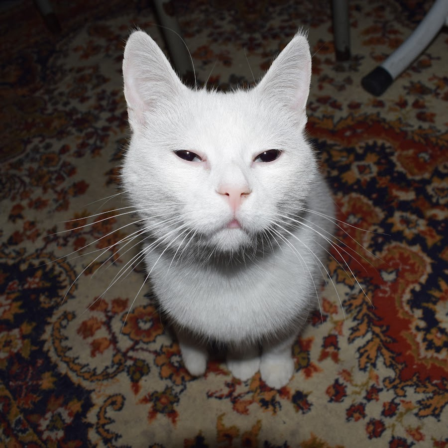

## About Me

I am currently studying in the ISME program at Freie Universität Berlin, focusing on political science and language studies.

My academic interests lie in the intersection of politics, culture, and multilingualism.
I aim to use my studies to better understand global dynamics and contribute to inclusive communication across cultures.

## Research Interest

- Turkish political life and state-society relations  
- Kurdish language (Kurmancî) and its sociolinguistic dimensions  
- Minority politics and cultural rights in contemporary Turkey  
- Language policy and linguistic justice  
- Oral traditions and memory studies in Kurdish communities  
- Multilingualism and identity in politically contested spaces  
- The intersection of nationalism and language suppression  
- Educational access and curriculum design for minority languages  
- Comparative analysis of minority policies in the Middle East  
- The role of civil society in shaping minority rights discourse  
- State violence, resistance narratives, and counter-memory  
- Kurdish diaspora and transnational activism  
- Policy analysis on language preservation and revitalization  
- Interethnic tensions and everyday identity negotiation in urban Turkey  
- Political instrumentalization of language in nation-building projects  

## Publications

1. E. Karaberk, Published in: Journal of Published Academia, Vol. 1, Issue 1, April 2025, Freie Universität Berlin
2. E. Karabark, Published in: Journal of Published Academia, Vol. 2, Issue 1, May 2025, Freie Universität Berlin

## References

* God, There is no reference higher than God.